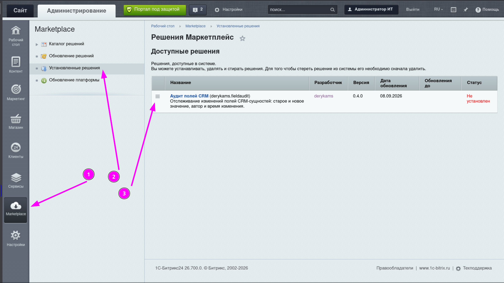
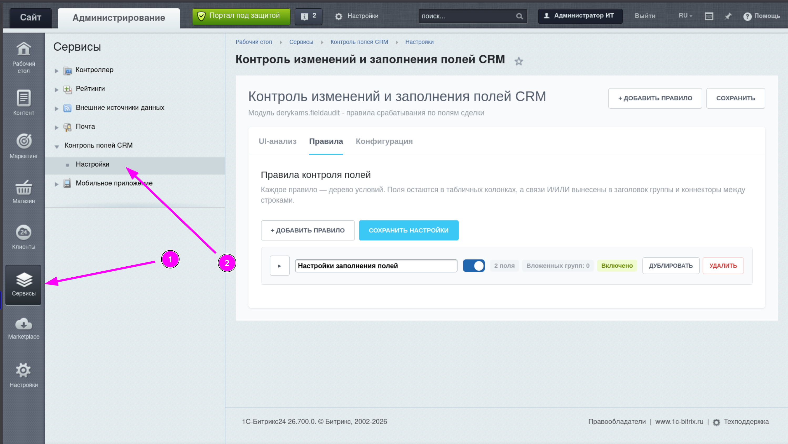
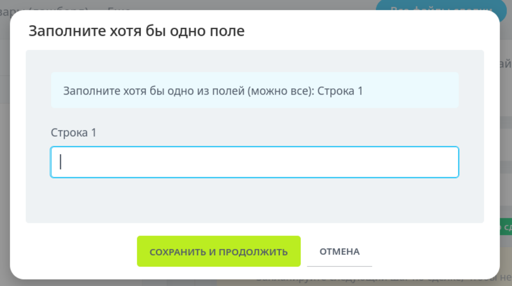

# Контроль полей CRM для Битрикс24 · derykams.fieldaudit

   

Модуль для коробочной версии Битрикс24, который не даёт сделке «убежать» на следующую стадию с незаполненными полями.

Представьте: менеджер тащит сделку по канбану, а поля «Договор» и «Акт» пустые. Обычный Битрикс24 либо молча пропустит, либо потребует каждое поле по отдельности. Этот модуль открывает всплывающее окно прямо в канбане и карточке сделки: заполни хотя бы одно из нужных полей — и едь дальше. Логика полей настраивается визуально, без кода.

## Что умеет

- **Pop-up заполнения при переходе на стадию.** Сделку нельзя переместить на стадию, пока условие правила не выполнено. Окно открывается прямо поверх канбана и карточки сделки — поля можно заполнить не покидая страницу.
- **«Хотя бы одно» или «все».** Правило может требовать заполнить любое одно из выбранных полей (заполнено 1 из 2 — проверка пройдена) или все выбранные поля.
- **Гибкие условия без кода.** Дерево условий: «поле не заполнено / заполнено / изменилось / стало пустым» с логикой **И / ИЛИ** и вложенными группами. Условия полей комбинируются с условием стадии: «переходит на стадию С» или «находится на стадии С».
- **Запуск бизнес-процесса как действие.** Вместо окна заполнения правило может запускать шаблон БП — с защитой от повторных запусков.
- **Поиск поля по ID.** В сделке сотни пользовательских полей? Выбираете поле поиском по названию или ID (`UF_CRM_...`), а не прокруткой гигантского списка.
- **Журнал аудита.** Каждое изменение отслеживаемого поля пишется в таблицу: старое значение, новое, кто и когда.
- **Диагностика из коробки.** Подробный серверный журнал и консоль браузера объясняют, почему правило сработало или не сработало — без гаданий.

## Скриншоты

### Страница установки

Модуль устанавливается штатно, через Marketplace, за пару кликов:

### Страница настроек

Визуальный конструктор правил: поля с условиями, логика И/ИЛИ, выбор стадий и действие — всё в одном окне:

### Pop-up заполнения

При попытке перехода на контролируемую стадию сделка блокируется и открывается окно — заполните поле прямо здесь:

## Живой пример

Задача из реальной практики: *«Если поле А и поле Б не заполнены и сделка переходит на стадию С — покажи окно, где можно заполнить одно из полей или оба сразу»*.

Настройка занимает минуту:

1. Создайте правило с группой условий **И**.
2. Добавьте поле А → «На заполнение» → «Не заполнено».
3. Добавьте поле Б → «На заполнение» → «Не заполнено».
4. Добавьте условие стадии → «Сделка переходит на стадию» → выберите стадию С.
5. Действие: **Окно заполнения**, режим «Заполнить хотя бы одно из выбранных полей».
6. Сохраните.

Готово: пока оба поля пусты, сделка не сдвинется с места, а менеджер увидит понятное окно вместо загадочного молчания. Если заполнено хоть одно поле — проверка не срабатывает. Никакого кода, никаких доработок ядра.

## Установка

Требуется коробочный Битрикс24 с модулем CRM (тестировалось на v26.500.100, PHP 8.0+).

1. Скопируйте папку `derykams.fieldaudit` в `local/modules/` вашего портала.
2. Админка → **Marketplace → Установленные решения** → найдите «Аудит полей CRM» → **Установить**.
3. После установки в меню появится пункт: **Сервисы → Контроль полей CRM**.
4. Готово — открывайте настройки и создавайте первое правило.

Удаление безопасно: таблица журнала и настройки сохраняются, чтобы случайно не потерять собранные данные.

## Как это устроено

- Правила хранятся в `b_option` как JSON и валидируются на сервере (ограничения на глубину дерева, количество правил, уникальность ID).
- При сохранении сделки движок оценивает дерево условий: каждая группа применяет свою связь И/ИЛИ, из истинной ветки собираются поля для окна.
- Отклонённая операция запоминается в защищённом контексте (сессия, 15 минут, привязка к пользователю). После заполнения полей модуль повторно проверяет права, sessid, актуальность правил и только затем сохраняет поля вместе с исходным изменением стадии — штатным методом CRM.
- Pop-up поддерживает строковые, числовые, файловые поля, дату/дату-время (с календарём), Да/Нет и списки. Файлы — по одному за отправку для множественных полей.
- Сигнал окну передаётся HTTP-заголовком `X-Derykams-FieldAudit` и дублируется маркером в теле ответа — работает и в новом, и в старом канбане.

## Если что-то не срабатывает

У модуля двухсторонняя диагностика:

- **Сервер:** журнал `/upload/derykams.fieldaudit.log` — каждое решение правил с объяснением (какое поле проверялось, что было до/после, почему блокировка сработала или нет).
- **Браузер:** консоль (фильтр `[FieldAudit]`) — цепочка от получения ответа сервера до показа окна. Последние 200 событий доступны через `BX.FieldAuditRuntime.getLog()`.

## Технические детали

| | |
|---|---|
| Сущности | Сделки (+ аудит смарт-процессов) |
| Триггеры полей | изменение / заполнение (5 операторов) |
| Условия стадии | «переходит на» / «находится на», несколько стадий |
| Действия | окно заполнения, запуск БП |
| Pop-up | строки, числа, файлы, дата, Да/Нет, списки |
| Языки интерфейса | русский, английский |
